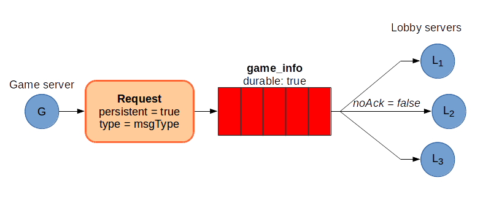
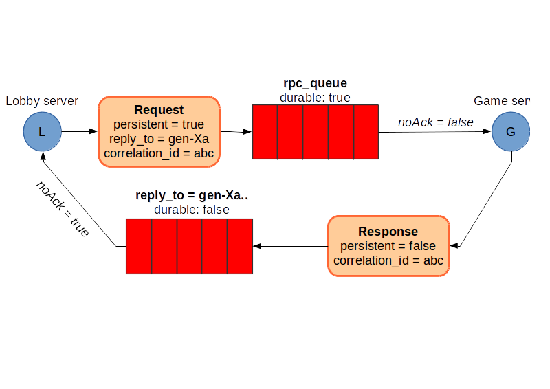

# Описание API и протоколов взаимодействия

TODO: добавить нормальное обоснование выбора.

## клиент <-> сервис поиска (UDP Multicast)
Multicast - единственный актуальный способ найти сервера в локальной сети, не имея их точного ip-адреса.
(Это справедливо при условии, что мы не контролируем DNS/DHCP сервера в сети, что подразумевается).
(Также стоит заметить, что IP Broadcast устарел, не поддерживается в IPv6 и имеет специфичные проблемы, описание которых выходит за рамки даного отчёта)

Клиент отправляет "hello" серверу, слушающему на Multicast-адресе. Сервер отправляет обратно
список вида "ip1:port1;ip2:port2;...;ipN:portN".

## Описание REST-api сервера "лобби"
Успешность вызова определяется кодом возврата:

 * 400 - Bad Request - неверный запрос;
 * 403 - Forbidden - нет прав;
 * 404 - Not Found - такого объекта нет;
 * 200 - Ok - запрос выполнен.

| path           | method | параметры      | возвращает                                                |
|----------------|--------|----------------|-----------------------------------------------------------|
| /signup        | POST   | user, password | auth_token                                                |
| /signin        | POST   | user, password | auth_token                                                |
| /games         | GET    | auth_token     | список всех игр (нужно ли?)                               |
| /games/open    | GET    | auth_token     | список игр, к которым можно присоедениться                |
| /games         | POST   | auth_token     | game_id(id  новой игры), gameserver_ip, create_game_token |


Параметры передаются через json, возвращается опять же json.

Пример списка игр, к которым можно присоедениться:

```javascript
[
    {
        id: "someid1", // mongodb ObjectId probably, but i'm not sure
        creator: "user1", // unicode!
        server_ip: "127.0.1.1:22222",
        join_token: "abracadabra" // about 16 random alphanumeric characters
    },
    {
        id: "someid2",
        creator: "юзер2",
        server_ip: "127.0.1.2:22223",
        join_token: "abacabacaca"
    }
]

```

В `auth_token` шифруется информация об имени пользователя, для чего выдан токен, кем выдан и т.п. Токен подписывается при помощи ключа сервера.
Клиент не должен и не может расшифровать токен, только использовать по назначению.

`create_game_token` и `join_token` -- строки из 16 случайных букв и цифр. Генерируются игровым сервером, передаются в лобби сервера через RabbitMQ.

## Описание отправляемых и принимаемых сообщений RabbitMQ

### Очередь "game_info"



Очередь с подтверждениями обработки сообщений.
В неё игровые сервера посылают сообщения и они равномерно распределяются между серверами lobby.

Сообщения:

1. Первый игрок присоединился (`msgType = "owner_connected"`).

```json
{
    "game_id" : 'asdfdsaf',
}
```

2. В игру зашел 2ой игрок, игра началась (`msgType = "opponent_connected"`).

```json
{
    "game_id" : 'asdfdsaf',
    "opponent" : 'user',
}
```

3. Игра завершена с таким-то результатом (`msgType = "game_ended"`).

```json
{
    "game_id" : 'asdfdsaf',
    "winner" : 'user',
}
```

### Очередь "rpc_queue"



Предназначена для поиска и назначения игровых серверов.

В ответ сервер отсылает:

```json
{
    "server_ip" : "127.0.1.1:2222",
    "create_token" : "abacabadadb",
    "join_token"   : "murmurmaumau",
}
```

## Websockets

От сервера клиентам:

 1. Игра началась

    ```json
    {
        "msg_type" : "opponent_connected",
        "opponent": "user"
    }
    ```

От клиента к серверу:

 1. "Я проиграл"

    ```json
    {
        "msg_type" : "lost",
    }
    ```

От клиента другому клиенту (через сервер):
сервер просто пересылает сообщение второму.

 1. custom JSON
    ```json
    {
        "msg_type" : "..etc..",
        ...
    }
    ```

 2. custom binary (flags.binary == True)

