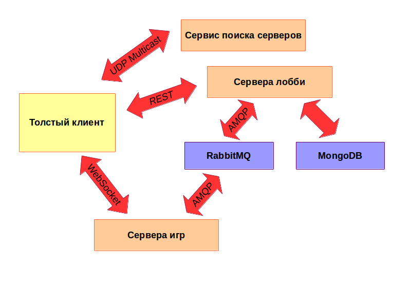

# Тетрис на двоих

Развитие всем известной игры с элементами мультиплеера и азарта (но без подлости).

## Идея

Два игрока параллельно играют в тетрис. Каждый видит и свою игру, и что происходит у второго игрока.
Задача - продержаться дольше, чем противник.

## Процесс с точки зрения игрока

 * Игрок открывает толстый клиент на своём компьютере.
 * Он автоматически находит сервера и подключается к одному из них.
 * Игрок либо регистрируется, либо входит в систему.
 * Клиент автоматически забирает список доступных для присоединения игр.
 * Клиент автоматически подключается либо к уже открытой игре либо создаётся новая.
 * Если он подключается к уже существующей игре, то сразу начинается собственно игра.
 * Если он создаёт новую, то начинается процесс ожидания второго игрока.
 * Как только соперник найден, запускается обратный отсчёт(3.. 2.. 1..) и игра начинается.
 * После окончания игры игрок может снова найти нового соперника и начать играть снова.
 * Если игрок по некоторой причине покидает игру (в том числе разрыв связи), то он автоматически проигрывает.

Предполагается, что обычный раунд заканчивается быстро, и поэтому второй игрок всёравно не будет ждать пропавшего, а пойдёт искать нового противника.

## Техническая часть

Система включает в себя:

 * Толстый клиент на Qt.
 * Сервис поиска серверов через UDP Multicast / Broadcast.
 * Сервера "лобби" -- отвечает за регистрацию, авторизацию, списки игр.
 * Сервера игр (умеют обрабатывать логику игр и сообщать результат).
 * Сервера MongoDB для хранения данных о пользователях и результатов игр.
 * Сервера RabbitMQ для общения между игровыми серверами и серверами "лобби".

Данная архитектура позволяет разделить реализацию на несколько
независимых сервисов, которые слабо взаимодействуют между собой. Это обеспечивает высокую отказоустойчивость и лёгкость масштабирования посредством
добавления новых серверов. В качестве БД выбрана MongoDB в следствие своей
открытости, кроссплатформенности, масштабируемости и отказоустойчивости
(при работе в кластере). По аналогичным соображением в качестве
сервера очередей сообщений выбран RabbitMQ.

### Сервис поиска серверов

Сервер слушает на Multicast адресе `224.0.0.111` и `13334` порту (это настраивается). При получении любого запроса на свой адрес и порт в ответ
отправляет заранее заданный список адресов серверов.

В сети может быть запущено несколько серверов поиска на разных компьютерах. В таком случае, клиент получит списки серверов от их обоих (что нормально).
При отключении одного из серверов оставшийся продолжит работать.

Реализация - однопоточный сервер на языке Python. В данном случае узким местом будет сеть, а не вычислительная скорость, поэтому многопоточность не требуется.
(Но если сильно хочется, можно запустить несколько таких сервисов на одном компьютере, но делать этого не рекомендуется).

### Толстый клиент

Клиент посылает запрос на Multicast адрес и получает в ответ от сервиса поиска список серверов "лобби". Выбирает из списка случайный и подключается к нему.
Если он не отвечает, пробует подключиться к другому случайному.

Общение с сервером "лобби" осуществляется через `REST`. Протокол описан далее.
Клиент регистрируется либо авторизуется на сервере "лобби" и получает токен для дальнейших операций на сервере.

После получения токена, клиент отправляет запрос на получение списка открытых игр серверу "лобби".
Если есть открытая игра, клиент начинает общаться с игровым сервером через WebSockets и ожидает начала игры.
Как только игровой сервер разрешает начать игру, игра начинается.
Через небольшие промежутки времени клиент передает информацию о его поле оппоненту через игровой сервер.
Когда пользователь проигрывает клиент посылает сообщение об этом другому клиенту через игровой сервер.
В случае ошибок при общении с игровым сервером связанных с проблемами сети или подключения, пользователь возвращается к поиску работающего игрового сервера.
Когда игра закончена пользователь может начать поиск новой игры нажатием Enter.

Технологии реализации: C++, Qt, WebSockets, UdpSockets, REST api

### Сервера "лобби"

Предоставляют REST-api для толстых клиентов. Сохраняют данные об играх и пользователях в MongoDB. Общаются с игровыми серверами через RabbitMQ.

Через RabbitMQ сервер "лобби" находит игровой сервер для новых клиентов, получает информацию о состоянии игр и их результатах.

Сервера "лобби" являются stateless, так как хранят всё своё состояние в БД. Это позволяет легко добавлять и убирать сервера из системы в зависимости
от нагрузки или при выходе из строя некоторых из них.

Реализован на node.js. Асинхронный.

### Игровые сервера

Общаются с клиентами через socket.io и с серверами лобби через RabbitMQ.

При включении посылают сообщение со своим адресом в rabbitmq. Также сообщают о подключении пользователей к играм и об их резульатах.

После начала игры обратывают игровую логику, получают информацию о ходах от игроков, обеспечивают синхронизацию игроков.

Каждый сервер может обрабатывать несколько игр одновременно. Протокол взаимодействия описан ниже.

Реализован на node.js. Асинхронный.

## Протоколы взаимодействия и обоснование их выбора

## Устойчивость и надежность системы

### Падение сервиса поиска
На запросы продолжает второй(3ий, 4ый..) сервер. Упавший сервис можно поднять на другом узле сети.

### Падение сервера лобби
Клиент переподключается к другому серверу из списка, полученного от сервиса поиска.
Так как сервера лобби не хранят состояний клиент просто продолжает работать как и раньше.
Можно поднять сервер лобби на любом компьютере, при условии что он есть в списке адресов сервиса поиска.

### Падение игрового сервера
Завершаются все игры, идущие на этом сервере. Остальная система работает без изменений.
Клиент возвращается к списку игр.

### Падение сервера RabbitMQ
RabbitMQ возможно настроить так, чтобы падение одного сервера на влияло на систему.

### Падение сервера MongoDB
MongoDB возможно настроить так, чтобы падение одного сервера на влияло на систему. 

### Падение клиента
Клиент запускает клиент снова и радуется.

